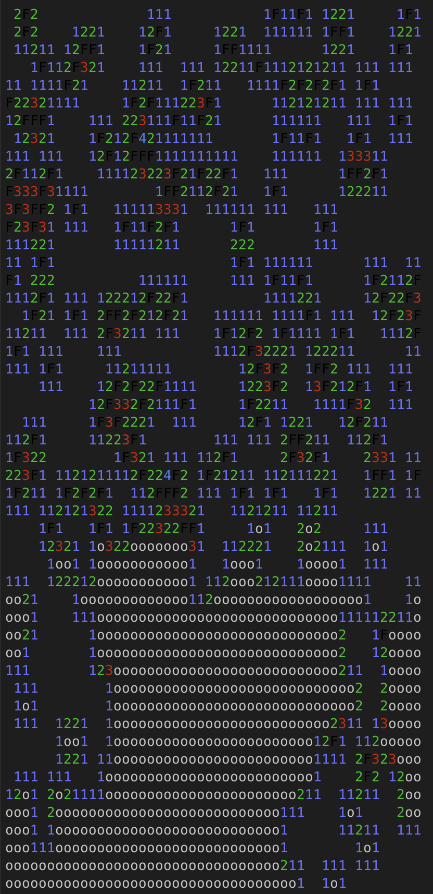

# Minesweeper experiment

- [x] Working Minesweeper game logic, including no-lose-on-first-click
- [x] Random strategy
- [x] Immediate deterministic strategy (when a cell has the same number of hidden neighbours as the number it shows, all those neighbours must be mines)
- [ ] More advanced deterministic strategies
- [ ] Probabilistic strategies when deterministic ones are not possible

